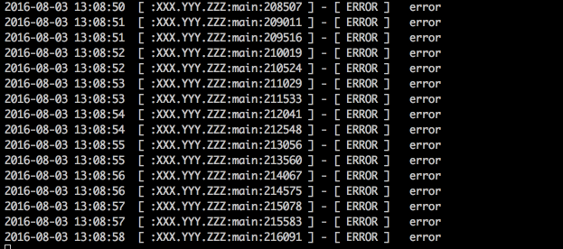

# CxxJLog4j

##山寨Log4j实现的C++强大类库.
<br/>
*英文版本: [English](README.md)*

### 目录
  - [特点](#特点)
  - [示例](#示例)
  - [配置](#配置)
  - [依赖](#依赖)
  - [TODO](#todo)
  - [Support](#support)

####特点
* 跨平台：同时支持Linux32/64、OSX64、Win64等平台；
* 高性能：同时具备C/C++和Java并发库的优点，性能爆棚；
* 易开发：高仿Log4j1.2，支持多种日志格式输出，api简单易用；
* 新卖点：支持程序运行过程中动态修改日志配置文件并实时生效!

####示例
  `c++:`
  
  ```
  #include "Efc.hh"
  #include "ELog.hh"
  
  static sp<ELogger> logger = ELoggerManager::getLogger("XXX.YYY.ZZZ");
  
  static void test_logger() {
    try {
      throw EException(__FILE__, __LINE__, "error");
    } catch (EException& e) {
	  logger->error(e);
	}
	
	logger->trace("无文件行号信息日志");
	logger->trace(__FILE__, __LINE__, "message");
  }
  
  int main(int argc, const char **argv) {
    // CxxJDK init.
    ESystem::init(argc, argv);
    // CxxLog4j init.
    ELoggerManager::init("log4e.properties");
    
    while (true) {
      test_logger();
      
      ELoggerManager::flushConfig(); //刷新配置!
	  EThread::sleep(500);
    }
    
    return 0;
  }
  
  ```



更多示例：  
[testlog.cpp](test/testlog.cpp)  

####配置
详见log4j官方properties配置方式。

配置示例：[log4e.properties](test/log4e.properties)

扩展功能：`CxxLog4j`支持内部变量的定义，获取变量值的方法是`$(variable)`，如

```
log.path = ./

log4j.appender.file.File = ${log.path}/logs/all.log
```

####依赖
`CxxLog4j`基于[CxxJDK](https://github.com/cxxjava/cxxjdk)开发.  

####TODO
    AsyncAppender

####Support
Email: [cxxjava@163.com](mailto:cxxjava@163.com)

